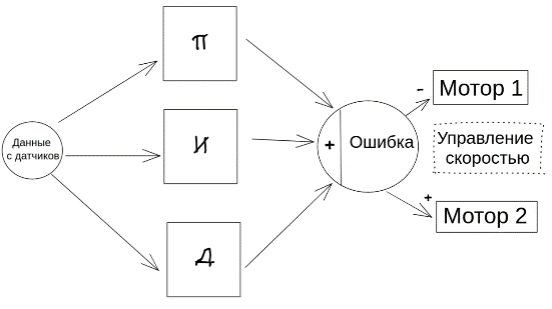
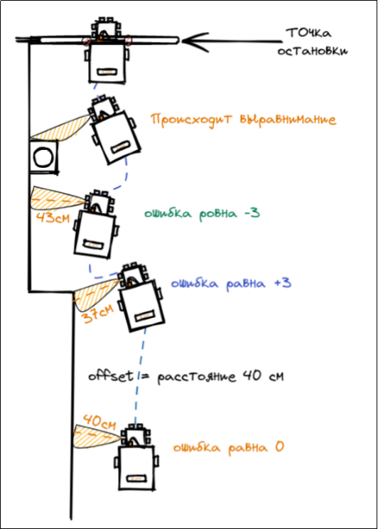

A [Link](https://pt.minhinprom.ru/w/iWwsueeKyiN4c76yRicwFh)
# **Введение**

Интеллектуальные системы придумали в конце 20-го века. С того времени на них выросли надежды корпораций, исследователей и обычных людей для получения решений задач, не требующих от человека описания конкретных алгоритмов. Сейчас интеллектуальной системой можно пользоваться через телефон, через сеть, через персональный компьютер.

# **Описание модели**

Схема работы разрабатываемой модели следующая. Робот получает со смартфона через мессенджер Telegram команду для движения. При помощи датчиков расстояния, расположенных в головной части он движется вдоль стены от одной контрольной точки до другой. Если на пути возникают препятствия, то робот их успешно объезжает и продолжает движение. Контрольные точки обозначены линиями ярко-белого цвета. Доезжая до одной из них робот останавливается при помощи датчиков линии и посылает уведомление на смартфон через Telegram бота.

Весь программный код написан на C++ с фреймворком Wiring доступен в приложении. Здесь же представим основные этапы алгоритма программы.

Для удобства используются специальные библиотеки: NewPing, GyverMotor, LiquidCrystal_I2C, Wire, AsyncStream, TimerMs. Ещё есть ПИД коэффициенты, настройки для алгоритма движения вдоль стены и для датчиков.

1. TimerMs – библиотека таймеров для реализации многозадачности.
2. NewPing – библиотека для работы с датчиками расстояния.
3. GyverMotor – библиотека для работы с двигателями для удобства и оптимизации.
4. LiquidCrystal_I2C, Wire – библиотеки для работы с символьным дисплеем по протоколу I2C.
5. AsyncStream - библиотеки для обработки пакетов данных присланных через протокол UART.

   **Устройство ПИД регулятора**

   ПИД регулятор состоит из трёх составляющих: пропорциональной P, интегрирующей I и дифференцирующей D, формируется просто как сумма трёх значений, умноженных каждая на свой коэффициент. Эта сумма после вычислений становится управляющим сигналом, который подаётся на управляющее устройство.

   kP, kI и kD это и есть те самые коэффициенты, которые нужно настроить для работы ПИДа. Значения тут могут быть самые разные, от 0.001 то десятков и тысяч, это зависит от конкретной системы.

   

Далее инициализируются функции:

1. PID – отвечает за корректировку траектории для движения вдоль стены на основе данных датчиков
2. readSensors – функция для снятия показаний с датчиков
3. walls – функция для удобной обработки расстояния до стены
4. SetSpeed - функция для удобного управления ходовой частью
5. dataToStr – функция для отладки

В нашем проекте ПИД регулятор принимает на вход две величины:

· входной сигнал - сигнал с датчика;

· offset - величина, к которой регулятор будет стремиться.

Переменные:

1. totalError – общая ошибка (безразмерная величина, которая подаётся на управляющее устройство);
2. kP - пропорциональный коэффициент, величина будет увеличиваться пропорционально разнице входного сигнала и offset;
3. kI - коэффициент интегрирующей составляющей, отвечает за накапливающуюся ошибку, позволяет сгладить пульсации и нивелировать маленькую ошибку;
4. kD - коэффициент дифференциальной составляющей, отвечает за скорость изменения величины, позволяет уменьшить раскачку системы

   

   ***
Демо: https://pt.minhinprom.ru/w/iWwsueeKyiN4c76yRicwFh

   Репозитории прошивок:

   1. [Для Arduino](https://github.com/GYelejin/NordLightBot)
   2. [Для ESP8266](https://github.com/GYelejin/NordLightBotWifi)
